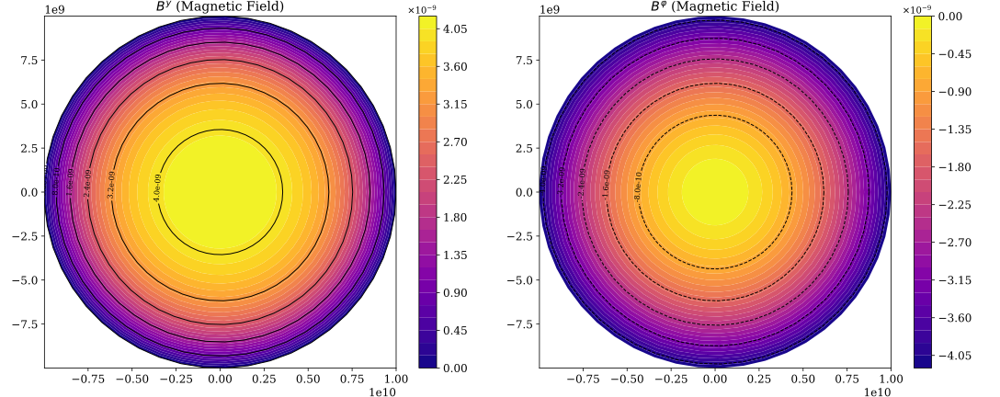
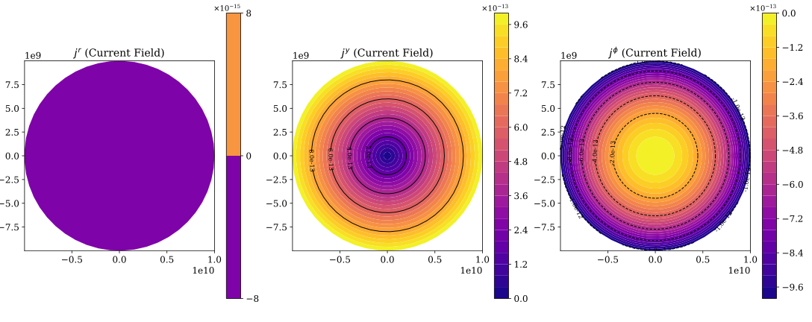
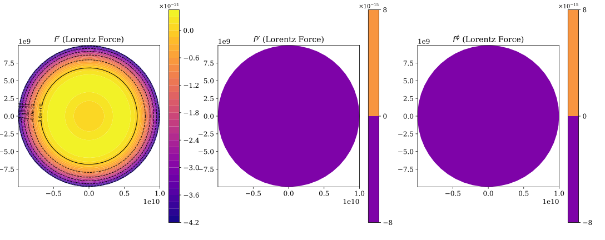
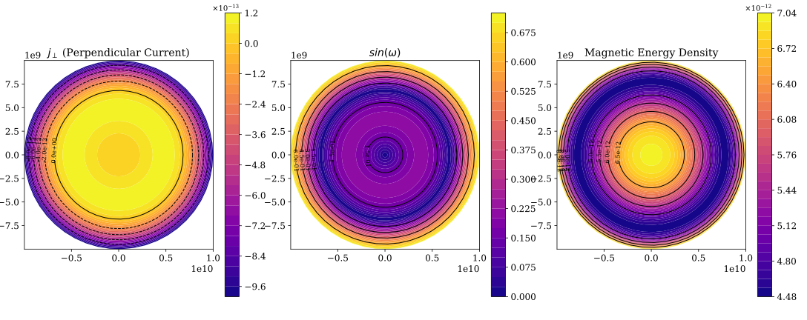
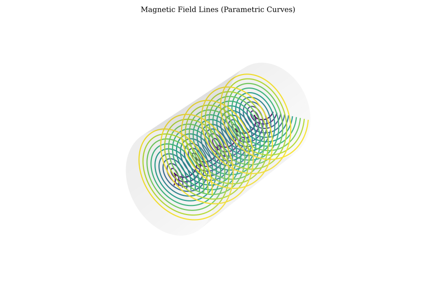
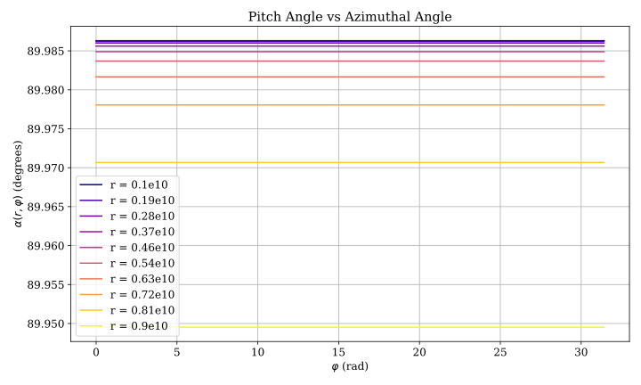
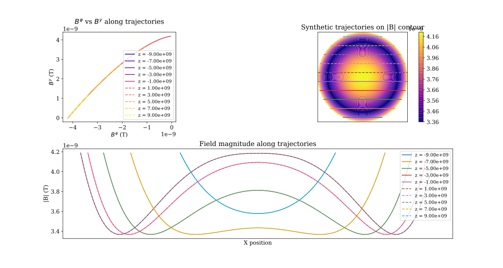

# Reporte de Resultados

## Magnitudes Físicas y Valores Geométricos

- **Flujo Axial Numérico**: 789568352087.1466
- **Corriente Axial Poloidal j_y_phi**: 34906585.0398865*(1.0*sin(phi)**2 + cos(phi)**2)*(1.0*sin(phi)**2 + 1.0*cos(phi)**2 + 2.0)/(pi*(33333333.3333333*sin(phi)**2 + 33333333.3333333*cos(phi)**2))
- **Helicidad Magnética**: 0
- **Energía Magnética Total**: 1718042247.5970294
- **Beta**: 1e-22
- **Alfa**: 1e-32
- **Delta**: 1.0
- **By0**: 1.33333333333333e-9*pi
- **Semieje menor R**: 10000000000.0
- **Semieje mayor a**: 10000000000.0
- **Longitud L**: 100000000000.0
- **R** (semieje menor): 10000000000.0
- **a** (semieje mayor): 10000000000.0
- **L** (longitud del cilindro): 100000000000.0
- **Δ** (delta): 1.0

## Expresiones Analíticas

- **\textbf{B}^\phi(r, \phi)** = $$ - 4.18879020478638 \cdot 10^{-29} r^{1.0} $$

- **\textbf{B}^y(r, \phi)** = $$ \pi \left(1.33333333333333 \cdot 10^{-9} - 1.33333333333333 \cdot 10^{-39} r^{3}\right) $$

- **\textbf{j}^r(r, \phi)** = $$ 0 $$

- **\textbf{j}^\phi(r, \phi)** = $$ - 1.0 \cdot 10^{-32} r $$

- **\textbf{j}^y(r, \phi)** = $$ \frac{3.14159265358979 \cdot 10^{-22} r}{\pi} $$

## Figuras

